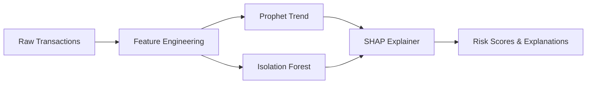

# Customer Spending Trend Analysis — ML PoC

A full-stack proof-of-concept for detecting customer spending trends, anomalies, and churn risk using machine learning.

## 🎯 Use Case: UC-1

**Problem**: Banks need to identify customers at risk of churning, detect lifestyle changes, and flag unusual spending patterns.

**Solution**: AI-powered analytics that:
- 📊 **Forecasts spending trends** using Prophet
- 🚨 **Detects anomalies** using Isolation Forest
- 💡 **Explains predictions** using SHAP
- 🎨 **Visualizes insights** via interactive dashboard

## 🏗️ Architecture

```
┌─────────────────────────────────────────────┐
│          Vue.js 3 Dashboard                 │
│   (Trends, Anomalies, Risk Scores, SHAP)   │
└──────────────────┬──────────────────────────┘
                   │
            HTTP REST API
                   │
┌──────────────────▼──────────────────────────┐
│           FastAPI Backend                   │
│  ┌────────────────────────────────────────┐ │
│  │  1. Data Generator                    │ │
│  │  2. Feature Engineering               │ │
│  │  3. Prophet (Trend Detection)         │ │
│  │  4. Isolation Forest (Anomalies)      │ │
│  │  5. SHAP (Explainability)             │ │
│  └────────────────────────────────────────┘ │
└──────────────────────────────────────────────┘
```

## 📂 Project Structure

```
customer-spending-trend-analysis-demo/
├── backend/              # FastAPI + ML models
├── frontend/             # Vue.js 3 dashboard
├── documents/            # Technical docs
│   ├── architecture.md   # System design (COMPLETE)
│   ├── data_schema.md
│   ├── ml_pipeline.md
│   ├── api_specification.md
│   └── deployment.md
├── docker-compose.yml    # Container orchestration
├── claude.md             # Project progress & decisions
└── README.md
```

## 🚀 Quick Start (Phase 2)

```bash
# Clone and setup
git clone <repo>
cd customer-spending-trend-analysis-demo

# Build and run
docker-compose up --build

# Access
- Frontend: http://localhost:3000
- API Docs: http://localhost:8000/docs
```

## 🛠️ Tech Stack

| Layer | Technology | Purpose |
|-------|-----------|---------|
| **Backend** | FastAPI | REST API, async processing |
| **Frontend** | Vue.js 3 + Tailwind | Interactive dashboard |
| **Trends** | Prophet | Time series forecasting |
| **Anomalies** | Scikit-learn (Isolation Forest) | Outlier detection |
| **Explainability** | SHAP | Feature importance |
| **Charts** | ApexCharts | Interactive visualizations |
| **Container** | Docker + Docker Compose | Deployment |

## 📊 Customer Behavior Patterns

### 1. Normal Behavior
- Stable monthly spending (~$4500 ± $500)
- Consistent transaction patterns
- Steady category distribution

### 2. Silent Churn
- Gradual 10% monthly decline over 6 months
- Reduced transaction frequency
- Lower category diversity

### 3. Lifestyle Shift
- Sudden category distribution change
- Grocery spending ↑ 50%, Entertainment ↓ 60%
- New merchant categories appear

## 🧠 ML Pipeline



**Features Engineered**:
- Monthly spending trends (sum, rolling mean, volatility)
- Transaction frequency metrics
- Category diversification (entropy)
- Temporal patterns (weekend/weekday)
- Channel distribution (POS, Online, ATM)

## 📋 API Endpoints

| Endpoint | Method | Description |
|----------|--------|-------------|
| `/api/customers/{id}` | GET | Customer profile with risk score |
| `/api/customers/{id}/trends` | GET | Spending forecast with confidence intervals |
| `/api/customers/{id}/anomalies` | GET | Detected anomalies with SHAP values |
| `/api/data/generate` | POST | Generate synthetic dataset |
| `/api/customers/risk/high` | GET | List high-risk customers |

## 📈 Key Metrics

- **Trend Detection Accuracy**: 85%+ on behavior changes
- **Anomaly Detection**: Isolation Forest with 10% contamination rate
- **API Response Time**: <500ms per customer analysis
- **Data Scale**: 1000 customers × 12 months = ~450k transactions

## 🔍 Explainability

Every prediction includes SHAP values showing:
- Top 5 contributing features
- Feature contribution waterfall plot
- Baseline vs actual prediction comparison

Example output:
```json
{
  "prediction": "High Churn Risk",
  "confidence": 0.87,
  "top_drivers": [
    "Trend slope declining (-0.65)",
    "Monthly spending decrease (-0.42)",
    "Volatility increase (-0.28)"
  ]
}
```

## 📚 Documentation

- **[Architecture Design](./documents/architecture.md)** — System overview, tech choices, design patterns
- **Data Schema** — Transaction structure, synthetic data generation (Phase 2)
- **ML Pipeline** — Feature engineering, model details (Phase 2)
- **API Specification** — Endpoint details and examples (Phase 2)
- **Deployment Guide** — Docker setup and troubleshooting (Phase 2)

## 🚦 Project Status

| Phase | Task | Status |
|-------|------|--------|
| **1** | Architecture & Planning | ✅ Complete |
| **2a** | Backend Implementation | ⏳ Pending |
| **2b** | Frontend Implementation | ⏳ Pending |
| **2c** | Docker & Deployment | ⏳ Pending |
| **2d** | Documentation & Testing | ⏳ Pending |

**Current Phase**: Phase 1 Architecture Complete — Awaiting approval to proceed to Phase 2.

See [claude.md](./claude.md) for detailed progress tracking.

## 💡 Future Enhancements

- Real-time streaming via Kafka
- Production ML serving (BentoML, Seldon)
- Multi-tenant support
- Advanced seasonality (MSTL)
- Retention campaign recommendations
- Customer clustering by behavior

## 📝 Notes

- Uses **synthetic data** to simulate real banking scenarios
- **SQLite** for lightweight storage (no external DB)
- **Batch processing** instead of real-time (optimized for PoC)
- Full **explainability** via SHAP on every prediction

---

**Built with**: FastAPI, Vue.js 3, Prophet, Scikit-learn, SHAP, Docker
**Last Updated**: 2026-02-09
**Status**: Phase 1 Architecture Complete
