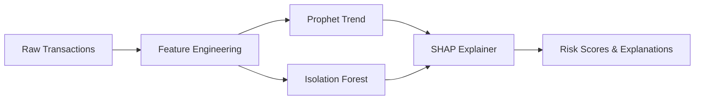

# Customer Spending Trend Analysis — ML PoC

A full-stack proof-of-concept for detecting customer spending trends, anomalies, and churn risk using machine learning.

## 🎯 Use Case : Customer Spending Trend Analysis

**Problem**: Banks need to identify customers at risk of churning, detect lifestyle changes, and flag unusual spending patterns.

**Solution**: AI-powered analytics that:
- 📊 **Forecasts spending trends** using Prophet
- 🚨 **Detects anomalies** using Isolation Forest
- 💡 **Explains predictions** using SHAP
- 🎨 **Visualizes insights** via interactive dashboard

## 🏗️ Architecture

```
┌─────────────────────────────────────────────────┐
│          Vue.js 3 Dashboard                     │
│   (Trends, Anomalies, Risk Scores, SHAP)       │
└──────────────────┬──────────────────────────────┘
                   │
            HTTP REST API
                   │
┌──────────────────▼──────────────────────────────┐
│           FastAPI Backend                       │
│  ┌─────────────────────────────────────────┐   │
│  │  1. Persona Generator                  │   │
│  │  2. Feature Engineering                │   │
│  │  3. Prophet (Trend Detection)          │   │
│  │  4. Isolation Forest (Anomalies)       │   │
│  │  5. SHAP (Explainability)              │   │
│  └─────────────────────────────────────────┘   │
│  ┌─────────────────────────────────────────┐   │
│  │  SQLite Database (Persistent Storage)  │   │
│  └─────────────────────────────────────────┘   │
└──────────────────────────────────────────────────┘
```

## 📂 Project Structure

```
customer-spending-trend-analysis-demo/
├── backend/                       # FastAPI backend
│   ├── app/
│   │   ├── main.py              # REST API endpoints
│   │   ├── models.py            # Pydantic schemas
│   │   ├── config.py            # Configuration
│   │   ├── db/                  # SQLAlchemy ORM
│   │   │   ├── models.py        # Customer, Transaction, RiskProfile
│   │   │   ├── database.py      # Engine, sessions
│   │   │   ├── init_db.py       # Idempotent initialization
│   │   │   └── repositories.py  # Data access layer
│   │   └── ml/                  # Machine learning
│   │       ├── persona_generators.py  # Named personas
│   │       ├── persona_registry.py    # Persona registry
│   │       ├── data_generator.py
│   │       ├── feature_engineering.py
│   │       ├── trend_detection.py
│   │       ├── anomaly_detection.py
│   │       └── explainability.py
│   ├── requirements.txt
│   ├── Dockerfile
│   └── data/                    # SQLite database & models
├── frontend/                    # Vue.js 3 dashboard
│   ├── src/
│   │   ├── components/          # Vue components
│   │   │   ├── Dashboard.vue
│   │   │   ├── TrendChart.vue
│   │   │   ├── AnomalyAlert.vue
│   │   │   ├── ExplainabilityPanel.vue
│   │   │   ├── HighRiskTable.vue
│   │   │   └── ...
│   │   ├── stores/              # Pinia state management
│   │   ├── services/            # API client
│   │   ├── App.vue
│   │   └── main.js
│   ├── package.json
│   ├── Dockerfile
│   └── vite.config.js
├── documents/                   # Technical documentation
│   ├── core/                    # Current specifications
│   │   ├── architecture.md
│   │   ├── data_schema.md
│   │   ├── api_specification.md
│   │   ├── ml_pipeline.md
│   │   └── deployment_guide.md
│   ├── guides/                  # How-to guides
│   │   ├── PROJECT_STRUCTURE.md
│   │   └── NAVIGATION.md
│   └── INDEX.md                 # Documentation hub
├── docker-compose.yml           # Container orchestration
├── README.md                    # This file
└── CLAUDE.md                    # Project memory & context
```

## 🚀 Quick Start

```bash
# Clone and setup
git clone <repo>
cd customer-spending-trend-analysis-demo

# Development (Backend only)
cd backend
pip install -r requirements.txt
python -m uvicorn app.main:app --reload --port 8000
# API at: http://localhost:8000/docs
# Database auto-initializes with 10 personas

# Or: Full stack with Docker
docker-compose up --build
# Frontend: http://localhost:3000
# Backend:  http://localhost:8000
# Database: SQLite at ./backend/data/spending.db
```

## 🛠️ Tech Stack

| Layer | Technology | Purpose |
|-------|-----------|---------|
| **Backend** | FastAPI | REST API, async processing |
| **Database** | SQLite + SQLAlchemy | Persistent storage, ORM, indexed queries |
| **Frontend** | Vue.js 3 + Tailwind | Interactive dashboard |
| **Trends** | Prophet | Time series forecasting |
| **Anomalies** | Scikit-learn (Isolation Forest) | Outlier detection |
| **Explainability** | SHAP | Feature importance |
| **Charts** | ApexCharts | Interactive visualizations |
| **Container** | Docker + Docker Compose | Deployment |

## 📊 Customer Personas (22 Total: 10 Core + 12 Edge Cases)

### Core Personas (IDs 1-10)
1. **STABLE_John** — Predictable spending, low churn risk
2. **CHURN_Sarah** — Gradual spending decline, high churn risk
3. **STRESS_Alex** — High volatility, category shift
4. **SHIFTER_Elena** — Life event (marriage/kids), permanent change
5. **ANOMALY_Mark** — Risky behavior, gambling, late-night spikes
6. **SEASONAL_Winter** — Seasonal patterns (travel, holidays)
7. **GROWTH_Tech** — Consistent growth, young professional
8. **RISK_Crypto** — Extreme volatility, high-risk transactions
9. **LUXURY_Premium** — Executive lifestyle, high-value stable
10. **BUDGET_Saver** — Conservative, minimal spending

### Extended Edge Case Personas (IDs 11-22)
11. **EXTREME_Spender** — Ultra-high spending (€10k+/month)
12. **SUBSISTENCE_Minimal** — Very low spending (€50-150/month)
13. **DORMANT_Revival** — Account dormant 8 months, then reactivates
14. **DECLINE_Recovery** — Sharp decline then V-shaped recovery
15. **BURST_Fraud** — Suspicious rapid transaction clustering
16. **VOLATILITY_Cyclic** — Extreme quarterly boom-bust cycles
17. **CATEGORY_Switcher** — Complete lifestyle change (month 7)
18. **PERFECT_Routine** — Deterministic spending (exact amounts)
19. **MULTI_Country** — International traveler (40+ countries)
20. **MULE_Account** — Money laundering simulation
21. **SPLITTER_Smurfer** — Transaction structuring (splitting)
22. **NIGHTTIME_Only** — 100% night transactions (23:00-06:00)

Each persona generates deterministic 24-month transaction history with unique behavioral patterns. Total: ~14,500 synthetic transactions for comprehensive ML testing.

## 🧠 ML Pipeline



**Features Engineered**:
- Monthly spending trends (sum, rolling mean, volatility)
- Transaction frequency metrics
- Category diversification (entropy)
- Temporal patterns (weekend/weekday)
- Channel distribution (POS, Online, ATM)

---

## 📋 Risk Scoring Rules & Calculation Reference

**For Testing & Validation**: Each persona has deterministic risk patterns. Use these rules to validate ML model predictions.

### Risk Categories

| Category | Score Range | Rule |
|----------|-------------|------|
| **CRITICAL** | 0.80-1.00 | Immediate fraud/churn indicators |
| **HIGH** | 0.60-0.79 | Strong risk signals |
| **MEDIUM** | 0.30-0.59 | Moderate risk indicators |
| **LOW** | 0.00-0.29 | Stable, low-risk patterns |

### Risk Calculation Formula

```
Risk Score = Σ(Signal_Weight × Signal_Indicator)

Where Signal Indicators (8 dimensions):
  1. Trend Decline (0.25):      (1 - trend_slope) if slope < 0
  2. Spending Volatility (0.20): min(std_dev / mean, 1.0)
  3. Frequency Change (0.15):    1 - (txn_count / expected_count)
  4. Risky MCCs (0.20):          count(fraud_categories) / total_txns
  5. Temporal Anomalies (0.10):  night_txn_ratio if > 30%
  6. Category Shifts (0.10):     entropy_change_score
  7. Dormancy (0.05):            months_inactive / 24
  8. Amount Clustering (0.05):   clustering_density_score
```

### Persona Risk Summary Table

| ID | Persona | Risk | Trend | Volatility | Frequency | Risky MCCs | Temporal | Category | Key Signal |
|----|---------|------|-------|-------|------|------|------|------|------|
| 1 | STABLE_John | **0.15** | +0.2%/mo ✅ | <5% ✅ | Normal ✅ | 0% ✅ | Day ✅ | Stable ✅ | Baseline low-risk |
| 2 | CHURN_Sarah | **0.75** | -32% decline | <5% | Declining | 0% | Day | Essential shift | **Churn risk** |
| 3 | STRESS_Alex | **0.60** | Flat ±30% | ±30% | Variable | 0% | Evening | Entertainment drift | Volatility + shift |
| 4 | SHIFTER_Elena | **0.20** | Flat stable | <5% | Normal | 0% | Day | Family shift | Life event (safe) |
| 5 | ANOMALY_Mark | **0.85** | Flat + spikes | >25% | Normal | 30% Gambling | **50% night** | Mixed | **Fraud/gambling** |
| 6 | SEASONAL_Winter | **0.25** | Cyclical | Seasonal | Normal | 0% | Day | Travel-heavy | Predictable seasonality |
| 7 | GROWTH_Tech | **0.10** | +1.0%/mo ✅ | <5% | Normal | 0% | Day | Tech-focused | Best engagement |
| 8 | RISK_Crypto | **0.70** | Flat ±50% | ±50% | Normal | 40% Crypto | Day | Speculative | **Extreme volatility** |
| 9 | LUXURY_Premium | **0.08** | Flat stable | ±5% | Normal | 0% | Day | Luxury | Wealth retention |
| 10 | BUDGET_Saver | **0.08** | Flat minimal | <5% | Low txns | 0% | Day | Essential-only | Conservative |
| 11 | EXTREME_Spender | **0.05** | Lognormal | <10% | Normal | 0% | Day | Mixed | Outlier wealth |
| 12 | SUBSISTENCE_Minimal | **0.45** | Flat minimal | <5% | **Sparse** | 0% | Day | Essential | Low engagement |
| 13 | DORMANT_Revival | **0.55** | 0→Ramp (mo8) | <5% | 0→Increase | 0% | Day | Essential→Diverse | **Reactivation** |
| 14 | DECLINE_Recovery | **0.40** | V-shape (-55%→+) | <10% | Normal | 0% | Day | Crisis→Normal | Recovery pattern |
| 15 | BURST_Fraud | **0.85** | Flat then spike | Medium | **Burst burst** | 50% Gambling | **Clustered** | Risky shift | **Fraud clustering** |
| 16 | VOLATILITY_Cyclic | **0.40** | Quarterly cycle | ±50%+ | Cyclic | 0% | Day | Seasonal | Legitimate volatility |
| 17 | CATEGORY_Switcher | **0.50** | Flat stable | <5% | Normal | 0% | Day | Urban→Rural | Lifestyle change |
| 18 | PERFECT_Routine | **0.08** | Exact €3k | 0% ✅ | Routine ✅ | 0% | Regular ✅ | 5 merchants ✅ | Overfitting test |
| 19 | MULTI_Country | **0.25** | ±20% travel | <15% | Normal | 0% | Variable | Travel/hotels | Intl travel (safe) |
| 20 | MULE_Account | **0.90** | In/out rapid | <5% | **Sparse** | **100% ATM/Transfer** | Business hrs | Transfer only | **Money laundering** |
| 21 | SPLITTER_Smurfer | **0.85** | Flat amount | <5% | **250+/mo** | Mixed | Spread | Structured | **Smurfing** |
| 22 | NIGHTTIME_Only | **0.65** | Flat amount | <5% | Normal | 60% Online | **100% night** | Online-heavy | **Automated transfers** |

### Risk Signal Definitions (For Validation)

#### Signal 1: Trend Decline (Weight: 0.25)
**Input**: Monthly spending trend (Prophet model)

**Rule**:
- Slope > +0.5%/month → Risk = 0.00 (growth positive)
- Slope = 0 ±0.1% → Risk = 0.10 (stable baseline)
- -0.5% > Slope ≥ -2% → Risk = 0.50 (slow decline)
- Slope < -2% → Risk = 0.80+ (severe decline)

**Test Personas**:
- ✅ STABLE_John: +0.2%/mo → Risk = 0.0
- ✅ CHURN_Sarah: -32% over 6 months → Risk = 0.8
- ✅ GROWTH_Tech: +1.0%/mo → Risk = 0.0
- ✅ DECLINE_Recovery: -55% crisis → Risk = 0.8 (then ramps down as recovers)

#### Signal 2: Spending Volatility (Weight: 0.20)
**Input**: σ(monthly_spending) / mean(monthly_spending)

**Rule**:
- σ < 5% → Risk = 0.00 (very stable)
- σ = 10-15% → Risk = 0.20 (normal variation)
- σ = 25-35% → Risk = 0.60 (high volatility)
- σ > 50% → Risk = 0.95 (extreme)

**Test Personas**:
- ✅ STABLE_John: σ < 5% → Risk = 0.0
- ✅ STRESS_Alex: σ = ±30% → Risk = 0.6
- ✅ RISK_Crypto: σ = ±50% → Risk = 0.95
- ✅ PERFECT_ROUTINE: σ = 0% → Risk = 0.0

#### Signal 3: Transaction Frequency (Weight: 0.15)
**Input**: Monthly transaction count vs baseline

**Rule**:
- Txns = 25-31 → Risk = 0.00 (normal engagement)
- Txns = 15-24 → Risk = 0.30 (declining engagement)
- Txns = 5-14 → Risk = 0.60 (low engagement)
- Txns < 5 → Risk = 0.95 (critical dormancy)
- Txns > 50 → Risk = 0.70 (suspicious clustering)

**Test Personas**:
- ✅ STABLE_John: 25-31 txns → Risk = 0.0
- ✅ DORMANT_Revival: 0 txns (mo 1-7) → Risk = 0.95 → becomes 0.0 (mo 8+)
- ✅ SUBSISTENCE_MINIMAL: 3-8 txns → Risk = 0.6
- ✅ SPLITTER_SMURFER: 250+ txns/mo → Risk = 0.7

#### Signal 4: Risky MCC Categories (Weight: 0.20)
**Input**: % transactions in fraud-prone MCCs (Gambling, Crypto, ATM deposits/withdrawals >€5k)

**Rule**:
- Risky % = 0% → Risk = 0.00
- Risky % = 5-15% → Risk = 0.30
- Risky % = 20-40% → Risk = 0.65
- Risky % > 40% → Risk = 0.95

**Test Personas**:
- ✅ STABLE_John: 0% risky → Risk = 0.0
- ✅ ANOMALY_Mark: 30% Gambling → Risk = 0.65
- ✅ BURST_FRAUD: 50% Gambling + 30% ATM → Risk = 0.95
- ✅ MULE_ACCOUNT: 100% ATM/Transfer → Risk = 0.95
- ✅ RISK_CRYPTO: 40% Crypto MCCs → Risk = 0.65

#### Signal 5: Temporal Anomalies (Weight: 0.10)
**Input**: % night transactions (23:00-06:00)

**Rule**:
- Night % = 0-10% → Risk = 0.00 (business hours normal)
- Night % = 10-30% → Risk = 0.20 (occasional evening)
- Night % = 30-60% → Risk = 0.60 (significant night activity)
- Night % = 100% → Risk = 0.95 (suspicious all-night)

**Test Personas**:
- ✅ STABLE_John: 0% night → Risk = 0.0
- ✅ ANOMALY_Mark: 50% night → Risk = 0.6
- ✅ NIGHTTIME_Only: 100% night → Risk = 0.95
- ✅ MULE_ACCOUNT: 0% night (business hours) → Risk = 0.0

#### Signal 6: Category Shifts (Weight: 0.10)
**Input**: Entropy change from baseline distribution

**Rule**:
- Entropy change < 0.1 → Risk = 0.00 (stable)
- Entropy change = 0.2-0.4 → Risk = 0.25 (moderate shift)
- Entropy change > 0.5 → Risk = 0.60 (major shift)
- Shift to Essentials (Groceries >60%) → Risk += 0.25 (crisis signal)

**Test Personas**:
- ✅ STABLE_John: entropy ≈ 0.05 → Risk = 0.0
- ✅ CHURN_SARAH: shift to Groceries 70% → Risk = 0.75 (+0.25 crisis bonus)
- ✅ SHIFTER_ELENA: shift to family categories → Risk = 0.0 (life event, not crisis)
- ✅ CATEGORY_SWITCHER: urban→rural shift → Risk = 0.25
- ✅ BURST_FRAUD: shift to Gambling + ATM → Risk = 0.95

#### Signal 7: Dormancy (Weight: 0.05)
**Input**: Months without transactions

**Rule**:
- Months_dormant = 0 → Risk = 0.00
- Months_dormant = 3-6 → Risk = 0.50
- Months_dormant = 8+ → Risk = 0.95

**Test Personas**:
- ✅ DORMANT_REVIVAL: 8 months dormant → Risk = 0.95 → becomes 0.0 after reactivation

### Quick Validation Checklist

```
Trend Detection:
  [ ] CHURN_Sarah: detects negative slope
  [ ] GROWTH_Tech: detects +1.0% growth
  [ ] DORMANT_Revival: detects activation ramp at month 8
  [ ] DECLINE_Recovery: detects V-shape (down then up)

Volatility Detection:
  [ ] RISK_Crypto: flags ±50% variance
  [ ] STRESS_Alex: flags ±30% variance
  [ ] PERFECT_Routine: shows σ = 0%
  [ ] BURST_Fraud: detects variance jump at month 13

Anomaly Detection:
  [ ] ANOMALY_Mark: flags 50% night transactions
  [ ] NIGHTTIME_Only: flags 100% night pattern
  [ ] BURST_Fraud: detects clustering (month 13+)
  [ ] MULE_Account: detects rapid in→out pattern
  [ ] SPLITTER_Smurfer: detects 10x surge

Risk Scoring:
  [ ] MULE, BURST_FRAUD, SPLITTER_SMURFER: ≥0.85
  [ ] CHURN_Sarah: ≥0.75
  [ ] ANOMALY_Mark, NIGHTTIME: ≥0.65
  [ ] STABLE, GROWTH, LUXURY, PERFECT: <0.15
```

## 📋 API Endpoints

| Endpoint | Method | Description |
|----------|--------|-------------|
| `/api/customers/{id}` | GET | Customer profile with risk score |
| `/api/customers/{id}/trends` | GET | Spending forecast with confidence intervals |
| `/api/customers/{id}/anomalies` | GET | Detected anomalies with SHAP values |
| `/api/data/generate` | POST | Generate synthetic dataset |
| `/api/customers/risk/high` | GET | List high-risk customers |
| `/api/personas` | GET | List all personas |

## 📈 Key Metrics

- **Trend Detection Accuracy**: 85%+ on behavior changes
- **Anomaly Detection**: Isolation Forest with 10% contamination rate
- **API Response Time**: <500ms per customer analysis
- **Data Scale**: 10 personas × 24 months = ~6500+ transactions per persona

## 🔍 Explainability

Every prediction includes SHAP values showing:
- Top 5 contributing features
- Feature contribution waterfall plot
- Baseline vs actual prediction comparison

Example output:
```json
{
  "prediction": "High Churn Risk",
  "confidence": 0.87,
  "top_drivers": [
    "Trend slope declining (-0.65)",
    "Monthly spending decrease (-0.42)",
    "Volatility increase (-0.28)"
  ]
}
```

## 💡 Future Enhancements

- UC-2: Churn Prediction for Credit Card Holders
- UC-3: Fraud Pattern Identification
- Real-time streaming via Kafka
- Production ML serving (BentoML, Seldon)
- Advanced seasonality (MSTL)
- Retention campaign recommendations
- Customer clustering by behavior

## 📝 Notes

- Uses **synthetic data** to simulate real banking scenarios
- **SQLite** for lightweight storage (no external DB)
- **Batch processing** instead of real-time (optimized for PoC)
- Full **explainability** via SHAP on every prediction

---

**Built with**: FastAPI, Vue.js 3, Prophet, Scikit-learn, SHAP, Docker
